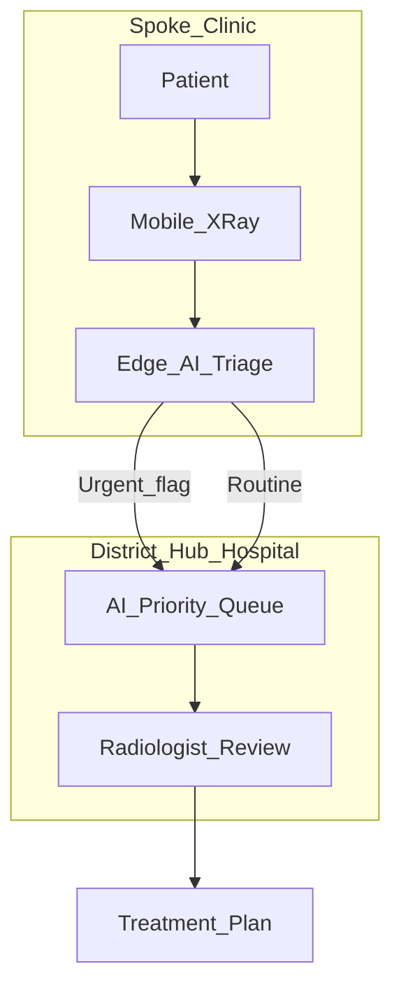

# Deployment Research: Low-Resource Healthcare Settings

## Research Question

> How could AI-assisted fracture detection be deployed in low-resource healthcare settings?

After building a fracture detection CNN, this analysis explores how similar systems could be adapted to improve healthcare accessibility in underserved regions — connecting the technical project to a global health discussion.

## Context: The Access Gap

Many communities worldwide lack radiologists, imaging specialists, and advanced diagnostic infrastructure. Consequences include delayed fracture diagnosis, improper immobilization, chronic pain, and higher mortality from untreated injuries. AI-assisted triage does not replace clinical expertise, but it may help **prioritize urgent cases** and **extend specialist reach** where specialists are scarce.

## Deployment Models Compared

### 1. Mobile X-Ray + Edge AI

**How it works:** A portable digital X-ray unit captures images at a clinic or field site. A compact AI model runs on-device (edge computer or embedded GPU) and flags suspected fractures for immediate attention.

| Aspect | Assessment |
|--------|------------|
| **Pros** | Works offline; fast triage; no cloud dependency; suitable for rural outreach |
| **Cons** | Hardware cost ($15k–$80k+ for portable digital systems); model must be small and efficient; maintenance in remote areas |
| **Fit for fracture X-rays** | **Strong** — X-rays are the standard first-line modality for suspected fractures |

**Example workflow:**
1. Patient presents at rural clinic with suspected fracture
2. Mobile X-ray image captured on-site
3. Edge AI scores image in seconds
4. Positive flag → urgent referral; negative → clinician review or follow-up

### 2. Cloud-Based Triage

**How it works:** X-ray images are uploaded to a cloud API where a centralized model performs inference. Results return to the clinic workstation or phone.

| Aspect | Assessment |
|--------|------------|
| **Pros** | Centralized model updates; no local GPU needed; easier to maintain one model version |
| **Cons** | Requires reliable internet; patient data privacy and regulatory concerns; latency in low-bandwidth areas |
| **Fit for fracture X-rays** | **Moderate** — viable where connectivity exists; fragile where it does not |

**Privacy considerations:** Medical images are sensitive. Cloud deployment requires encryption in transit and at rest, clear data governance, and compliance with local health data laws.

### 3. Smartphone-Assisted Radiology

**How it works:** Smartphones serve as interfaces — viewing DICOM images, capturing photos of analog films, or connecting to USB ultrasound probes.

| Aspect | Assessment |
|--------|------------|
| **Pros** | Very low barrier; phones are ubiquitous; useful for teleconsultation and image sharing |
| **Cons** | Not suitable for primary X-ray capture; image quality highly variable; limited for fracture detection directly |
| **Fit for fracture X-rays** | **Limited** — better for second opinion and hub-and-spoke consults than primary X-ray AI |

### 4. Hub-and-Spoke Model

**How it works:** Remote clinics (spokes) capture images; a district hospital (hub) provides radiologist review, optionally assisted by AI pre-screening that sorts the queue by urgency.

| Aspect | Assessment |
|--------|------------|
| **Pros** | Realistic hybrid; combines human expertise with AI prioritization; works with existing workflows |
| **Cons** | Still requires some specialist capacity at the hub; turnaround time depends on connectivity and staffing |
| **Fit for fracture X-rays** | **Strong and realistic** — mirrors how many low-resource health systems already function |

## Recommended Approach for Fracture Detection

For underserved communities, a **tiered strategy** is most realistic:

1. **Primary:** Hub-and-spoke with AI-assisted triage at the hub (or edge AI at spokes with mobile X-ray where affordable)
2. **Secondary:** Cloud API where connectivity and governance allow
3. **Avoid relying on:** Smartphone-only primary capture for X-ray fracture screening

## Requirements for Responsible Deployment

| Requirement | Why It Matters |
|-------------|----------------|
| Local validation | Models trained on one population may fail on another |
| Clinician in the loop | AI flags cases; humans make treatment decisions |
| Clear limitations signage | Staff must know FP/FN rates and scope |
| Data governance | Consent, storage, and transmission policies |
| Maintenance plan | Who updates the model? Who fixes hardware? |
| Equity monitoring | Track whether AI reaches the most underserved or only better-resourced clinics |

## Could AI Worsen Disparities?

Yes — if deployment follows existing inequality patterns:

- Wealthy hospitals adopt AI first; rural clinics wait years
- Models trained on high-income country data underperform elsewhere
- False negatives in underserved populations delay care further
- Cloud solutions exclude clinics without reliable internet

**Mitigation:** Target deployment explicitly at underserved sites; validate across diverse populations; use offline-capable edge models; fund hardware and training alongside software.

## Connection to This Project

The fracture detection CNN built in this repository demonstrates the **pattern recognition** component of the edge/hub workflow above. It is a research prototype — not deployment-ready — but it illustrates how the same technology applied to TB chest X-rays, pneumonia, or other modalities could support the access expansion thesis.

### Technical Feasibility Notes

| Consideration | Implication |
|---------------|-------------|
| Model size | CNNs can be compressed (quantization, pruning) for edge devices |
| Inference speed | Single-image inference in milliseconds on modern hardware — demo via `src/infer.py` |
| Input standardization | Low-resource scanners may produce different contrast/resolution — retraining or domain adaptation needed |
| Regulatory path | Real deployment requires clinical validation studies beyond this project |

## Key References

See [`../references/bibliography.md`](../references/bibliography.md) for full citations.

- WHO health workforce and diagnostic access reports
- NIH / peer-reviewed literature on AI-assisted radiology in low-resource settings
- Examples: CheXNet (pneumonia), diabetic retinopathy screening programs, portable X-ray initiatives

## Summary for Presentation (30 seconds)

> "I explored four deployment models — mobile X-ray with edge AI, cloud triage, smartphone-assisted review, and hub-and-spoke radiology. For fracture detection in underserved areas, the most realistic path combines portable X-ray with either on-device AI or AI-assisted prioritization at a district hospital. But deployment must be deliberate: without local validation and equitable access, AI could widen gaps instead of closing them."
